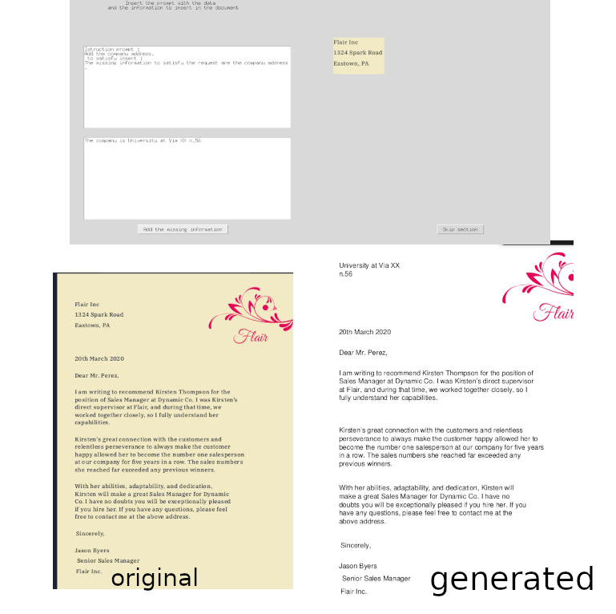

<div align="center">
<br>
<h3>LLM Based Multi-Agent Generation of Semi-structured Documents from Semantic Templates in the Public Administration Domain</h3>
  
<a href="https://scholar.google.com/citations?user=XLcFkmUAAAAJ&hl=it&oi=ao">Emanuele Musumeci</a><sup><span>1</span></sup>,
<a href="https://scholar.google.com/citations?user=sk3SpmUAAAAJ&hl=it&oi=ao/">Michele Brienza</a><sup><span>1</span></sup>,
<a href="https://scholar.google.com/citations?user=Y8LuLfoAAAAJ&hl=it&oi=ao">Vincenzo Suriani</a><sup><span>1</span></sup>,
<a href="https://scholar.google.com/citations?user=xZwripcAAAAJ&hl=it&oi=ao">Daniele Nardi</a><sup><span>1</span></sup>,
<a href="https://scholar.google.com/citations?user=_90LQXQAAAAJ&hl=it&oi=ao">Domenico D. Bloisi</a><sup><span>2</span></sup>
</br>

<sup>1</sup> Department of Computer, Control and Management Engineering, Sapienza University of Rome, Rome, Italy,
<sup>3</sup> International University of Rome UNINT, Rome, Italy

<div>

[](https://arxiv.org/abs/2402.14871)
[](LICENSE)

</div>


</div>

# Usage 

By loading a semi-structured document into this framework, you can generate a personalized document with your data while leveraging the structure of the original template. This pipeline efficiently processes templates, extracts semantic cues, and produces a complete document tailored to your needs, leveraging the power of LLMs.


## Features

- **Multi-Agent Architecture**:
  - **Semantics Identification Agent**: Extracts semantics and instructions from template sections.
  - **Information Retrieval Agent**: Retrieves and validates required data from the accumulated prompt.
  - **Content Generation Agent**: Creates document sections conforming to semantic instructions.
- **Incremental Prompt Refinement**: Continuously improves prompts for better context and output.
- **Template-Driven Workflow**: Processes document sections sequentially to maintain structure and semantics.
- **Interactive User Feedback**: Requests user input only when critical information is missing.

---
## Install
Clone this repo
```
git clone https://github.com/michelebri/multi_agent_document_generation
```

Create a conda environment
```
conda create -n nome_env python=3.8 && conda activate nome_env
pip install -r requirements.txt
```
Follow the guide to create an adobe API key:
```
https://developer.adobe.com/document-services/docs/overview/pdf-services-api/quickstarts/python/
```
Create you openai api key

Run the code with 
```
python generate.py
```

Upload a PDF from your local files to begin the creation process. After providing a prompt, you can optionally start without any input by clicking "Start the Creation Process." On the right, you will see the document's sections, where you can choose to modify or skip each section. In the first text box, you'll find suggestions from the Information Retrieval Agent. You can add the requested information and customize the document with your own data.

# Example
</div>



</div>
