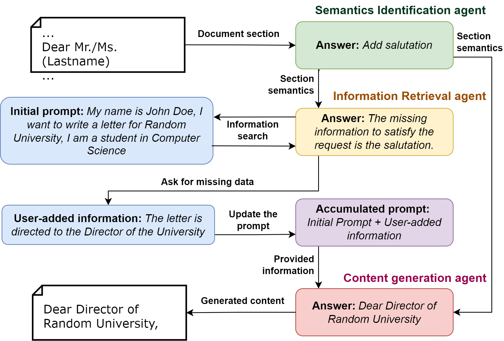

 
<h3>LLM Based Multi-Agent Generation of Semi-structured Documents from Semantic Templates in the Public Administration Domain</h3>
  
<a href="https://scholar.google.com/citations?user=XLcFkmUAAAAJ&hl=it&oi=ao">Emanuele Musumeci</a>1,
<a href="https://scholar.google.com/citations?user=sk3SpmUAAAAJ&hl=it&oi=ao/">Michele Brienza</a>1,
<a href="https://scholar.google.com/citations?user=Y8LuLfoAAAAJ&hl=it&oi=ao">Vincenzo Suriani</a>1,
<a href="https://scholar.google.com/citations?user=xZwripcAAAAJ&hl=it&oi=ao">Daniele Nardi</a>1,
<a href="https://scholar.google.com/citations?user=_90LQXQAAAAJ&hl=it&oi=ao">Domenico D. Bloisi</a>2
 

1 Department of Computer, Control and Management Engineering, Sapienza University of Rome, Rome, Italy,
3 International University of Rome UNINT, Rome, Italy

# Abstract
In the last years' digitalization process, the creation and management of documents in various domains, particularly in Public Administration (PA), have become increasingly complex and diverse. This complexity arises from the need to handle a wide range of document types, often characterized by semi-structured forms. Semi-structured documents present a fixed set of data without a fixed format. As a consequence, a template-based solution cannot be used, as understanding a document requires the extraction of the data structure. The recent introduction of Large Language Models (LLMs) has enabled the creation of customized text output satisfying user requests. In this work, we propose a novel approach that combines the LLMs with prompt engineering and multi-agent systems for generating new documents compliant with a desired structure. The main contribution of this work concerns replacing the commonly used manual prompting with a task description generated by semantic retrieval from an LLM. The potential of this approach is demonstrated through a series of experiments and case studies, showcasing its effectiveness in real-world PA scenarios.

# Usage 

By loading a semi-structured document into this framework, you can generate a personalized document with your data while leveraging the structure of the original template. This pipeline efficiently processes templates, extracts semantic cues, and produces a complete document tailored to your needs, leveraging the power of LLMs.

## Features

- **Multi-Agent Architecture**:
  - **Semantics Identification Agent**: Extracts semantics and instructions from template sections.
  - **Information Retrieval Agent**: Retrieves and validates required data from the accumulated prompt.
  - **Content Generation Agent**: Creates document sections conforming to semantic instructions.
- **Incremental Prompt Refinement**: Continuously improves prompts for better context and output.
- **Template-Driven Workflow**: Processes document sections sequentially to maintain structure and semantics.
- **Interactive User Feedback**: Requests user input only when critical information is missing.

---
## Install
